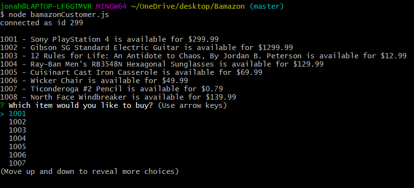
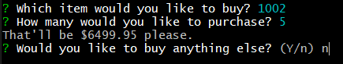
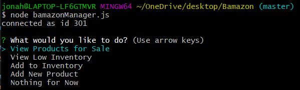
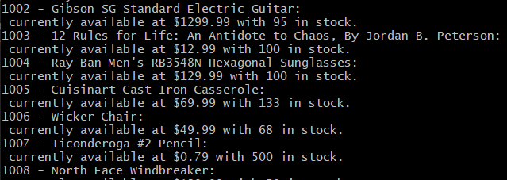
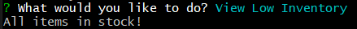
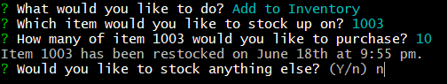
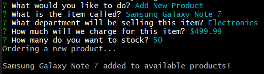

# Bamazon - for inventory using Node and MySQL

## A CLI App for playing the customer or the manager of an online store:

*Use `node bamazonCustomer.js` to find buy some new items.

*Use `node bamazonManager.js` to restock items and put new items on the shelves.

